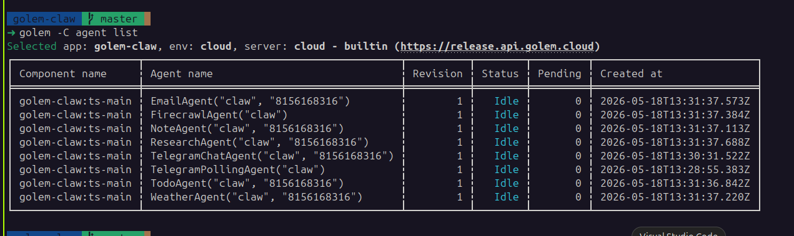
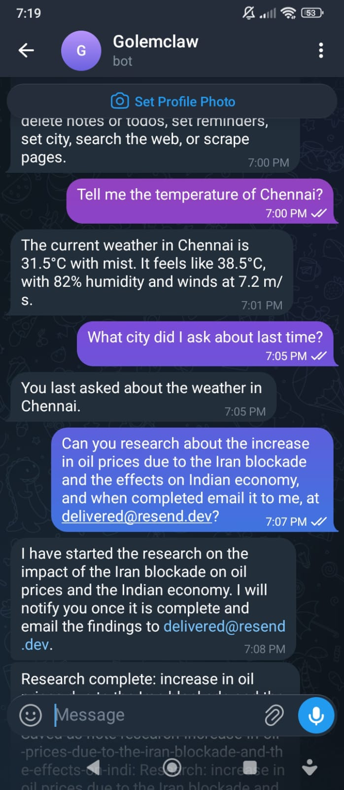

# Golem Claw

Golem Claw is a Telegram-first personal assistant built as a Golem TypeScript application. It is designed as a hackathon showcase for durable agents: every Telegram chat gets its own persistent assistant state, and background work such as reminders, research jobs, polling, and daily digests can continue without a traditional server process.

The current deployment mode uses Telegram polling, it is also possible to use webhooks with a help of HTTP API endpoint.(code exists as showcase, but doesnt do anything, something to explore in future).

## Screenshots





## What It Demonstrates

- Durable per-chat assistant state keyed by Telegram `chat.id`.
- Natural-language tool use for todos, reminders, notes, weather, web search, page scraping, email, profile memory, goals, and research.
- Background research jobs that search the web, scrape sources, write a saved research note, and notify the user when complete.
- Optional research follow-ups: email the finished note and/or add a review todo.
- Scheduled reminders and daily digests using Golem scheduled invocations.
- Long-term memory and goal tracking that survive across messages and invocations.
- Telegram polling with durable offset tracking, so processed updates are not repeated.
- A restored webhook agent is still declared in code, but it is not deployed through `golem.yaml` right now.

## Capabilities

### Conversational Assistant

The main interface is plain Telegram chat. Slash commands exist for quick browsing and status, but most mutations are intended to happen through natural language.

Examples:

```text
Remember that I prefer concise morning summaries.
My email is me@example.com and my city is Bangalore.
Add a todo to renew my passport.
Remind me tomorrow at 9 AM to call the bank.
Save a note that the demo should focus on durable agents.
Find recent news about Golem Cloud.
Scrape https://example.com and summarize it.
Research Firecrawl's current API and save a note.
Research durable execution examples and email me when done.
Send an email to me@example.com with subject Demo plan and body Here is the plan...
I want to improve my sleep. Track it as a goal.
I slept 7 hours yesterday and felt better today.
```

The assistant keeps a short recent chat history, a compact long-term summary, explicit long-term memory, tracked goals, and daily chat logs.

### Todos And Reminders

Todos are stored in a durable `TodoAgent(botName, chatId)` for each Telegram chat.

Supported behavior:

- Add todos through natural language.
- Delete todos through natural language.
- List todos with `/todos` or natural language.
- Set reminders from natural language time requests.
- List active reminders with `/reminders`.
- Fire reminders later without needing the user to message again.

Reminder example:

```text
Remind me next Friday at 3 PM to submit the report.
```

When a reminder is created, it is also added to the todo list if it is not already present. The scheduled `fireReminder` invocation later sends a Telegram message like:

```text
Reminder: submit the report
```

### Notes And Research Notes

Notes are durable and readable by stable names such as `note-demo-focus` or `research-firecrawl-api`.

Supported behavior:

- Save notes through natural language.
- List notes with `/notes`.
- Read a note with `/note <name>`.
- Edit note text, title, or readable name through natural language.
- Delete notes through natural language.
- Store research output as first-class research notes.

Examples:

```text
Save a note: For the demo, show polling, memory, reminders, and research.
Rename the demo note to note-demo-script.
Update note-demo-script with the final demo flow.
Delete the old demo note.
```

### Weather

Weather uses OpenWeather and a durable saved default city.

Supported behavior:

- Save a default city through natural language or `addUserInfo`.
- Ask for current weather in any named city.
- Ask `/weather` to use the saved default city.

Examples:

```text
My city is Bangalore.
What's the weather?
What's the weather in Tokyo?
```

### Web Search And Page Scraping

Firecrawl powers live web access.

Supported behavior:

- `webSearch` finds up to five web results for current or unknown information.
- `webScrape` reads a specific HTTP or HTTPS page and returns markdown to the assistant.
- Firecrawl calls are routed through `FirecrawlAgent(botName)`, which serializes access per bot.

Examples:

```text
Search the web for the latest Golem Cloud docs.
Scrape https://learn.golem.cloud and summarize what changed.
```

### Background Research Without Email

Research jobs are handled by `ResearchAgent(botName, chatId)` and run asynchronously. The chat agent starts the job, triggers `runResearch`, and immediately replies that work has started.

For a research-only flow:

```text
Research the current Firecrawl v2 scrape endpoint and save the findings.
```

The research agent then:

- Searches the web with Firecrawl.
- Scrapes up to three result pages.
- Asks Gemini to write a concise markdown research note with summary, key points, caveats, and source URLs.
- Saves the note in `NoteAgent` as a research note.
- Sends a Telegram completion message with the saved note name.

The final message looks like:

```text
Research complete: Firecrawl v2 scrape endpoint
Saved as note research-firecrawl-v2-scrape-endpoint: Research: Firecrawl v2 scrape endpoint
Read it with /note research-firecrawl-v2-scrape-endpoint
```

### Background Research With Email

Research can also email the completed note. If the user has saved a default email, the assistant can use it automatically. The user can also provide an explicit recipient.

Examples:

```text
Research Golem durable agents and email me the result when done.
Research Telegram bot polling tradeoffs and email it to team@example.com.
Research Golem Cloud deployment steps, email me the note, and add a todo to review it tomorrow.
```

When email is requested, the research agent sends the same saved research note through Resend after the note is generated. If a completion todo is requested, it also adds that todo after the research completes.

### Email

Email is separate from research. `EmailAgent(botName, chatId)` stores email addresses and sends plain text email through Resend.

Supported behavior:

- Save or update a default email with `/email <address>` or natural language.
- List saved email addresses with `/emails`.
- Send a direct email by natural language.
- Use the saved default recipient when no recipient is provided.
- Use Resend idempotency keys for mutation-style sends.

Examples:

```text
My email is me@example.com.
Send me an email with subject Reminder and body Bring up the daily digest during the demo.
Send an email to teammate@example.com with subject Demo and body The bot is ready.
```

### Memory And Profile

The assistant has long-term memory separate from raw chat history. It only stores useful durable facts, preferences, constraints, profile details, and goal context.

Supported profile fields:

- Email address.
- Default city.
- Display name.
- Timezone or locale preference.
- Durable preferences or important profile facts.

Examples:

```text
My name is Chinu and I prefer short direct answers.
Remember that I usually work in IST.
My default city is Bangalore and my email is me@example.com.
```

The `addUserInfo` path can update multiple pieces of profile information in one turn. Email and city are routed to their dedicated durable agents, while durable facts are merged into long-term memory.

### Goals

Goals are stored in the chat agent with an inferred tracking plan and recent progress entries.

Supported behavior:

- Add a goal with `/goal <goal>` or natural language.
- List goals with `/goals`.
- Log progress through natural language.
- Include goals and recent progress in the daily digest.
- Use goals as context for future replies.

Examples:

```text
I want to get healthier. Track that as a goal.
I walked 7,000 steps today and slept 6.5 hours.
What goals are you tracking?
```

For broad goals, the assistant asks Gemini to infer a compact tracking plan, such as checking habits, blockers, measurements, or recurring signals.

### Daily Digest

Each chat agent keeps per-day logs for recent days and schedules a daily digest around 21:00 server time.

The digest uses:

- Long-term memory.
- Tracked goals and progress.
- Conversation summary.
- Open todos.
- Saved notes.
- Research job status.
- Full chat log for the day.
- Previous available day log.

The digest is sent to Telegram. If a default email exists, it is also sent by email.

You can request it immediately with:

```text
/daily
```

## Slash Commands

Slash commands are shortcuts for browsing, status, or simple setup. They are intentionally not added to the long-term LLM chat history.

| Command | Purpose |
| --- | --- |
| `/start` | Show help. |
| `/help` | Show help. |
| `/notes` | List saved notes and research notes. |
| `/note <name>` | Read a saved note by readable name. |
| `/todos` | List todos. |
| `/reminders` | List active reminders. |
| `/weather` | Show current weather for the saved default city. |
| `/emails` | List saved email addresses. |
| `/email <address>` | Save or update the default email address. |
| `/goals` | List tracked goals. |
| `/goal <goal>` | Add a tracked goal and infer a tracking plan. |
| `/daily` | Generate today's digest immediately. |
| `/research <topic>` | Start a background research note without email. |
| `/research_jobs` | List recent research jobs and note names. |

## Agent Architecture

| Agent | Role |
| --- | --- |
| `TelegramPollingAgent(botName)` | Polls Telegram `getUpdates`, stores offset, and routes messages by `chat.id`. |
| `TelegramChatAgent(botName, chatId)` | Owns chat orchestration, LLM tool routing, history, memory, goals, daily logs, and digest scheduling. |
| `TodoAgent(botName, chatId)` | Stores todos and scheduled reminders. |
| `NoteAgent(botName, chatId)` | Stores notes and research notes. |
| `WeatherAgent(botName, chatId)` | Stores default city and fetches current weather. |
| `EmailAgent(botName, chatId)` | Stores recipients and sends email through Resend. |
| `FirecrawlAgent(botName)` | Performs Firecrawl search and scrape calls. |
| `ResearchAgent(botName, chatId)` | Runs asynchronous research jobs and follow-ups. |
| `TelegramWebhookAgent(name)` | Webhook-compatible transport kept in code, but not deployed in the current polling manifest. |

## Telegram Polling

The app currently uses polling instead of webhooks. The poller stores Telegram's update offset durably and routes every update by incoming `message.chat.id`:

```ts
TelegramChatAgent.get(botName, String(message.chat.id))
```

Polling status includes:

- Whether polling is enabled.
- Current Telegram offset.
- Processed update count.
- Consecutive failure count.
- Last poll timestamp.
- Last error.
- Next scheduled poll timestamp.

Before starting polling, disable any Telegram webhook. Pending updates can be dropped for a fresh demo setup:

```sh
curl "https://api.telegram.org/bot$BOT_TOKEN/deleteWebhook?drop_pending_updates=true"
```

## Configuration

`golem.yaml` contains placeholder secret defaults for local and cloud environments:

```yaml
secretDefaults:
  local:
    botToken: "REPLACE_WITH_TELEGRAM_BOT_TOKEN"
    geminiApiKey: "REPLACE_WITH_GEMINI_API_KEY"
    firecrawlApiKey: "REPLACE_WITH_FIRECRAWL_API_KEY"
    weatherApiKey: "REPLACE_WITH_OPENWEATHER_API_KEY"
    resendApiKey: "REPLACE_WITH_RESEND_API_KEY"
    resendFromEmail: "Golem Claw <bot@example.com>"
    webhookSecret: "REPLACE_WITH_WEBHOOK_SECRET"
```

Required external services:

- Telegram Bot API for chat transport.
- Gemini for replies, tool routing, summaries, research-note writing, memory updates, and goal-plan inference.
- Firecrawl for web search and page scraping.
- OpenWeather for city resolution and current weather.
- Resend for email delivery.

Gemini native function responses are disabled in this code path. Tool calls use generated JSON because the selected model requires `thought_signature` for native tool response turns.

## Deploy To Golem Cloud

The manifest sets `cloud` as the default environment.

Authenticate and deploy:

```sh
/home/chinu/code/golem-x86_64-unknown-linux-gnu -C account get
/home/chinu/code/golem-x86_64-unknown-linux-gnu deploy --yes
```

For a clean hackathon demo redeploy:

```sh
/home/chinu/code/golem-x86_64-unknown-linux-gnu deploy --yes --reset
```

To explicitly select cloud:

```sh
/home/chinu/code/golem-x86_64-unknown-linux-gnu -C deploy --yes
```

## Start The Poller

After deploying, start one poller instance for the bot name `claw`:

```sh
/home/chinu/code/golem-x86_64-unknown-linux-gnu -C agent invoke --trigger 'TelegramPollingAgent("claw")' start
```

Check status:

```sh
/home/chinu/code/golem-x86_64-unknown-linux-gnu -C agent invoke 'TelegramPollingAgent("claw")' status
```

Stop polling:

```sh
/home/chinu/code/golem-x86_64-unknown-linux-gnu -C agent invoke 'TelegramPollingAgent("claw")' stop
```

## Local Testing

Deploy locally with:

```sh
/home/chinu/code/golem-x86_64-unknown-linux-gnu -L deploy --yes --reset
```

Start the local poller with:

```sh
/home/chinu/code/golem-x86_64-unknown-linux-gnu -L agent invoke --trigger 'TelegramPollingAgent("claw")' start
```

Check local status:

```sh
/home/chinu/code/golem-x86_64-unknown-linux-gnu -L agent invoke 'TelegramPollingAgent("claw")' status
```

Trigger one immediate poll while testing:

```sh
/home/chinu/code/golem-x86_64-unknown-linux-gnu -L agent invoke 'TelegramPollingAgent("claw")' poll
```

## Suggested Demo Flow

1. Start with `/help` to show the command surface.
2. Save profile context: `My name is Chinu, my city is Bangalore, and my email is me@example.com.`
3. Add a todo: `Add a todo to polish the Golem demo.`
4. Set a reminder: `Remind me tomorrow at 9 AM to rehearse the demo.`
5. Add a goal: `I want to ship this hackathon project. Track that as a goal.`
6. Save a note: `Save a note that polling avoids the cloud domain problem.`
7. Run research-only: `/research Golem durable execution examples`.
8. Run research with email: `Research Telegram polling tradeoffs and email me when done.`
9. Send standalone email: `Send me an email with subject Demo status and body The assistant can now research, remember, and follow up.`
10. Generate digest: `/daily`.

## Current Limitations

- Telegram transport currently handles text messages only.
- Polling runs every 60 seconds for demo simplicity.
- Webhook code exists, but no HTTP API deployment is enabled in `golem.yaml`.
- The daily digest schedule uses server-local date logic around 21:00.
- Research scrapes up to three pages and truncates page content for LLM context.
- Email delivery depends on a valid Resend API key and a sender allowed by the Resend account.
